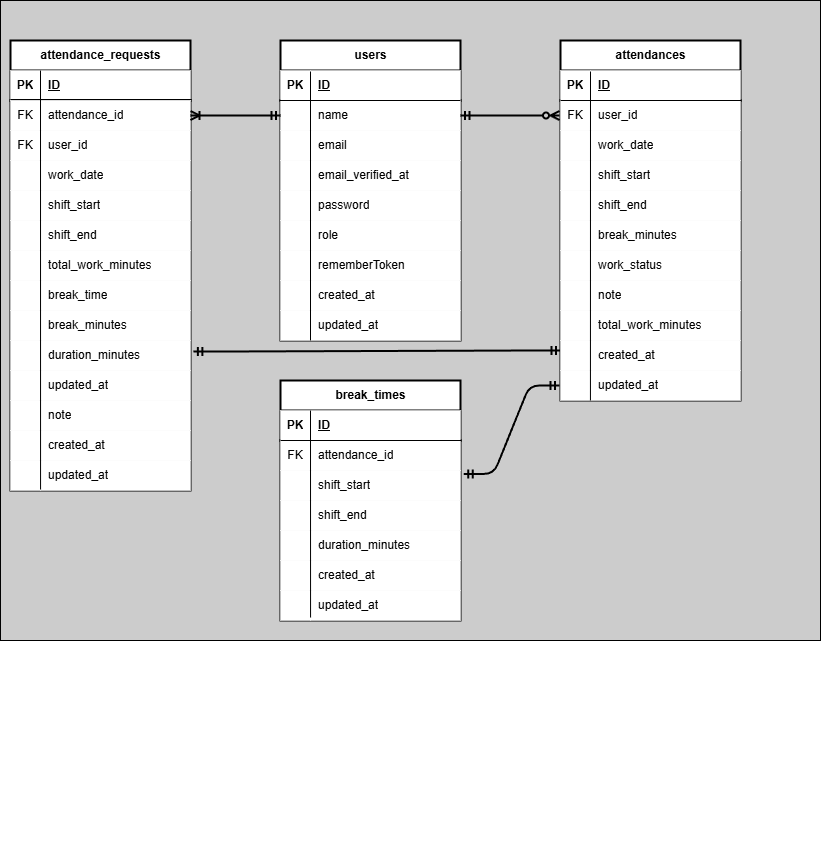

# 勤怠管理アプリ(新模擬案件2)

## 概要
勤怠管理アプリ

## 環境構築
**Dockerビルド**
1. `git@github.com:KOU-jpg/kintai-app.git`
2. DockerDesktopアプリを立ち上げる
3. docker-compose up -d --build

**Laravel環境構築**

1. docker-compose exec php bash
2. composer install
3. 「.env.example」ファイルを 「.env」ファイルに命名を変更。または、新しく.envファイルを作成
4. .envに以下の環境変数を追加
``` text
DB_CONNECTION=mysql
DB_HOST=mysql
DB_PORT=3306
DB_DATABASE=laravel_db
DB_USERNAME=laravel_user
DB_PASSWORD=laravel_pass

MAIL_MAILER=smtp
MAIL_HOST=mailhog
MAIL_PORT=1025
MAIL_USERNAME=null
MAIL_PASSWORD=null
MAIL_ENCRYPTION=null
MAIL_FROM_ADDRESS=no-reply@example.com
MAIL_FROM_NAME="【模擬案件フリマアプリ】メール認証"
```

5. アプリケーションキーの作成
``` bash
php artisan key:generate
```

6. マイグレーションの実行
``` bash
php artisan migrate
```

7. シーディングの実行
``` bash
php artisan db:seed
```


## 使用技術(実行環境)
- PHP8.4.3
- Laravel8.83.29
- MySQL8.0.26
- Nginx 1.21.1
- phpMyAdmin（latest）
- MailHog（latest）

## ER図


## URL
- 開発環境：http://localhost/
- phpMyAdmin:：http://localhost:8080/
- SMTPサーバー: localhost:1025
    - アプリのメール送信設定で使用
- Web UI: http://localhost:8025/
    - ブラウザでアクセスし、送信されたメールを確認
